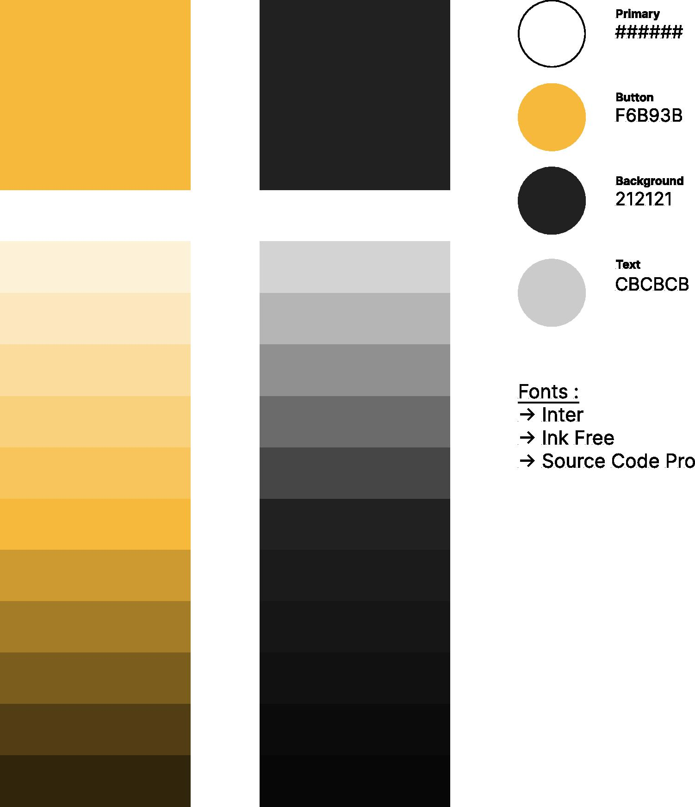
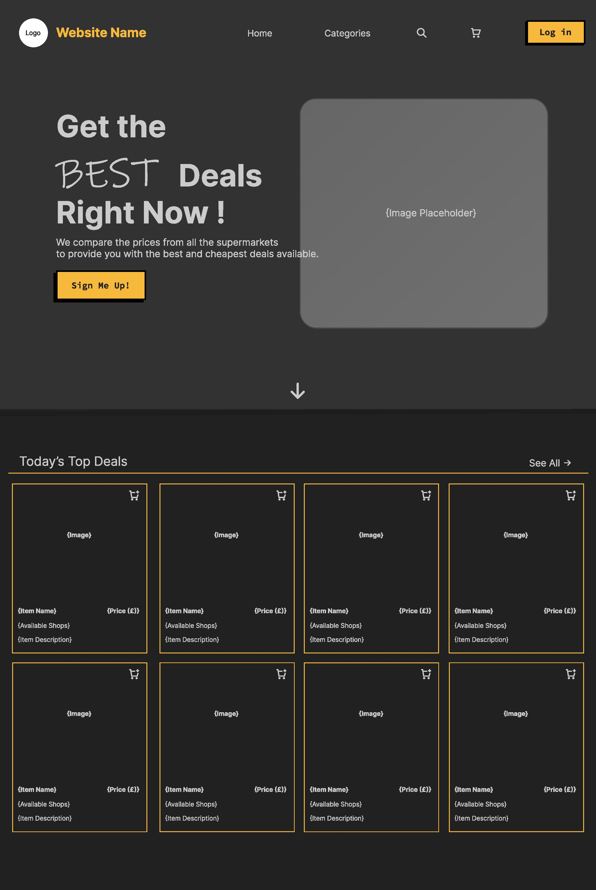
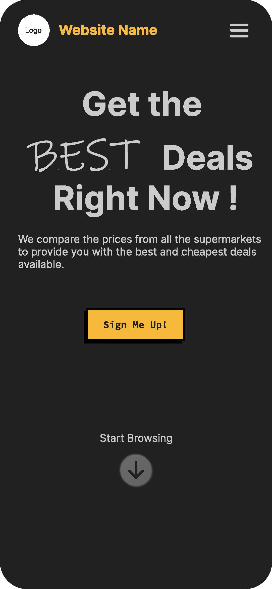

# Design Specification

## Introduction 📝

This chapter focuses on the detailed design of the web application based on the requirements in the previous chapter. The architecture of the system and various UI created for each page will be explored and discussed here.

## Architecture 🏛️

The client-server is a common model used in web applications.

The client side of the architecture design includes the user interface and the server responsible for processing requests. In the user interface there are actions that the user can do to make a request to the server side and the development of the user interface is shown in the ‘User Interface’ section below. These actions include navigating to different pages, login, register and search. It is important to know that the Flask framework does server-side rendering.

The server is comprised of files such as ‘init.py’ which defines the initialisation code for the application such as the blueprints. All necessary logic is coded in the server side. An Object-relational mapping (ORM) is utilised in the ‘models.py’ file to create the schema of the database.

Using the client-side architecture with Flask provides a lightweight and flexible framework for building web applications. Additionally, this architecture can provide a balance between scalability and performance, as the server is necessary for providing the data and resources, while the client handles the display. 🌟

## Database Design 💾

The main information this project needs to store are the user information and the product information. In the Entity Relationship Diagram below (ERD), there are four primary entities: User, Basket, Basket Item, and Product.

Their relationship to each other is as follows; there will only be one basket per user and the basket will hold the information of the product. The relationship between the basket and product was many to many, however data normalisation was applied to it to reduce data redundancy and improve data integrity. The intermediate table ‘basket_item’ stores the relationship between the two entities while keeping their data separate.

## User interface 🖼️

### First Iteration :one:

The initial design iteration focused on a minimalistic look with pastel green colours. While the green colour scheme matched the website's purpose of a price comparison website, the design lacked emphasis on buttons such as the browse button. The product card design was oversimplified and lacked space for more user action buttons.

### Final Iteration :three:

In the final iteration, the design patterns and website structure stayed mostly the same, with a few changes to the product card design. The main update was the decision to change the colour scheme to black shades. Black gives a sleek and modern look, appealing to the target audience. It is associated with elegance and high-quality products, which are desirable in the e-commerce sector. The high contrast also helps important information, such as the price, stand out more prominently and improve readability, which can benefit people with visual impairments.

Overall, the decision to switch to black as the primary colour was strategic, creating a sophisticated and modern look for the website while still maintaining its functionality.

